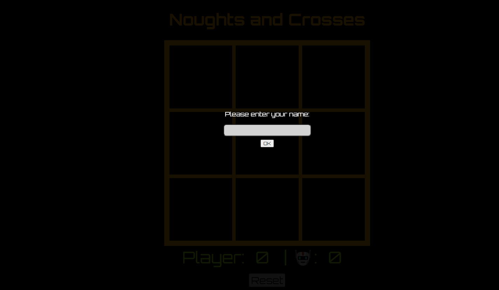

# Noughts and Crosses

This is a single player noughts and crosses game that was created without the use of a tutorial when I was first starting to learn JavaScript. It informs the player of the end of game status i.e. win, loss, draw and updates the score accordingly. The game is played against the computer, which uses a simple algorithm to determine its moves. The game is also responsive and can be played on mobile devices.

## Gameplay

## Installation
No installation is required, simply open the index.html file in your browser to play the game.

## Created with

